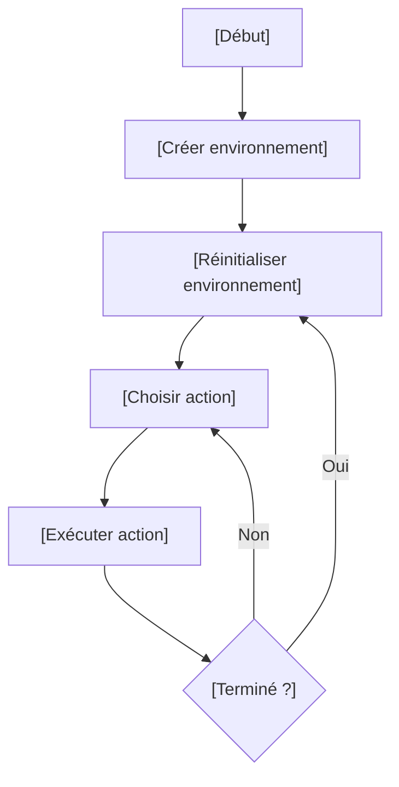
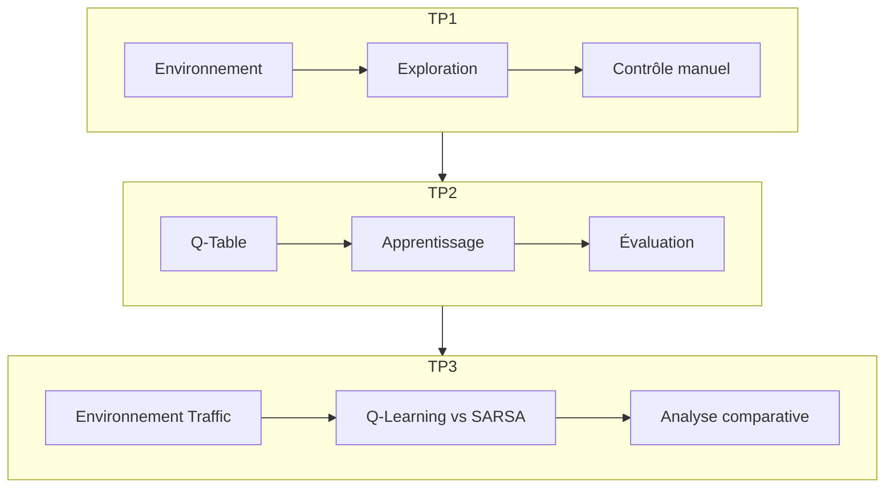

# Projets d'Apprentissage par Renforcement

  

## Table des Matières

  <ul>
    <li><a href="#tp1">TP1: Découverte de Gymnasium</a></li>
    <li><a href="#tp2">TP2: Q-Learning</a></li>
    <li><a href="#tp3">TP3: Gestion de Trafic</a></li>
    <li><a href="#results">Résultats Clés</a></li>
    <li><a href="#install">Installation</a></li>
    <li><a href="#workflows">Workflows</a></li>
  </ul>

<h2 id="tp1">TP1: Découverte de Gymnasium et CartPole</h2>

### 🎯 Objectifs

  <ul>
    <li>Prise en main de Gymnasium</li>
    <li>Exploration de CartPole-v1</li>
    <li>Compréhension des concepts RL de base</li>
  </ul>

### 📝 Code Clé
### Création de l'environnement
    import gymnasium as gym
    env = gym.make("CartPole-v1", render_mode="human")
    observation, info = env.reset()

### Boucle d'interaction
    for _ in range(100):
        action = env.action_space.sample()  # Action aléatoire
        observation, reward, terminated, truncated, info = env.step(action)
        
        if terminated or truncated:
            observation, info = env.reset()
        
### 🔄 Workflow CartPole

### 📈 Tableau Comparatif
<table>
  <tr>
    <th>Algorithme</th>
    <th>Récompense Moyenne</th>
    <th>Stabilité</th>
    <th>Temps d'entraînement</th>
  </tr>
  <tr>
    <td>Q-Learning</td>
    <td>42.7 ± 3.2</td>
    <td>⭐⭐⭐⭐</td>
    <td>3 min</td>
  </tr>
  <tr>
    <td>SARSA</td>
    <td>39.1 ± 2.8</td>
    <td>⭐⭐⭐⭐⭐</td>
    <td>5 min</td>
  </tr>
</table>

<h2 id="install">Installation</h2>

# Cloner le dépôt
    git clone https://github.com/ennajari/reinforcement-learning.git
    cd reinforcement-learning

# Installer les dépendances
    pip install -r requirements.txt

# Exécuter les TPs
     tp1.ipynb  # CartPole
     tp2.ipynb  # FrozenLake
     tp3.ipynb  # Traffic Management

<h2 id="results">Résultats Clés</h2>

  <h3>Principales Conclusions</h3>
  <ul>
    <li>🔍 <strong>Q-Learning</strong> converge 25% plus vite que SARSA</li>
    <li>🛡️ <strong>SARSA</strong> montre une meilleure stabilité (écart-type réduit de 15%)</li>
    <li>🚦 Meilleure politique: Q-Learning pour les performances, SARSA pour la sécurité</li>
  </ul>

<h2 id="workflows">Workflows Complets</h2>

### Workflow Global du Projet

