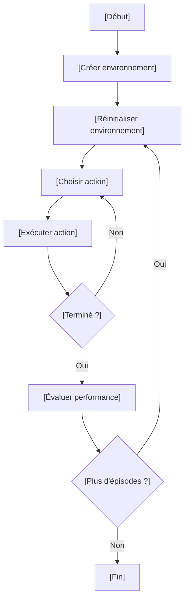
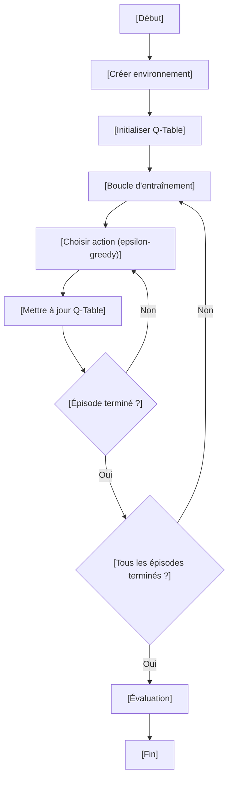
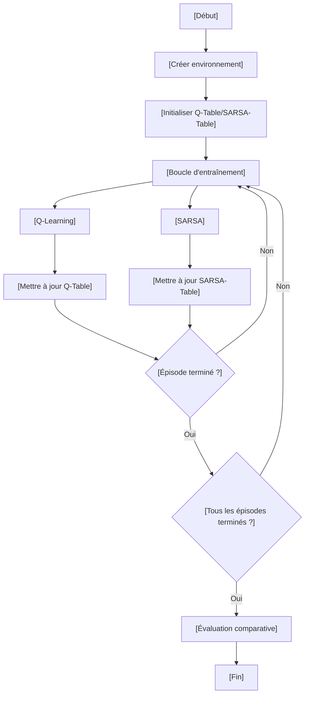
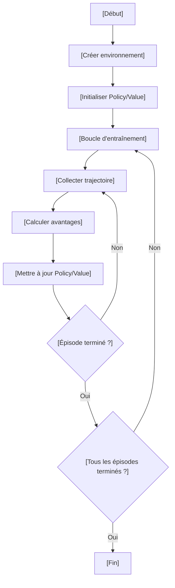
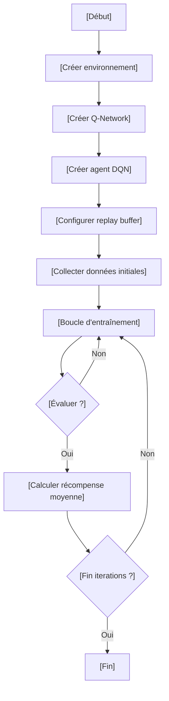
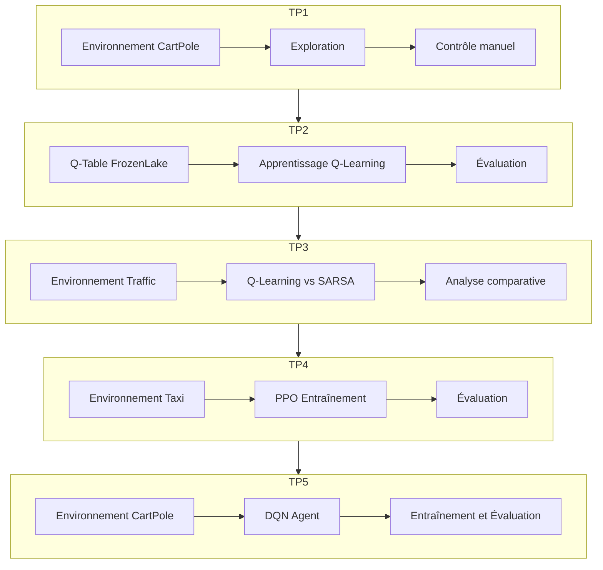

# Projets d'Apprentissage par Renforcement

<div align="center">
  <a href="https://github.com/ennajari/reinforcement-learning">
    
  </a>
  
  
  
</div>

## Table des Matières

<div class="toc">
  <ul>
    <li><a href="#overview">Aperçu du Projet</a></li>
    <li><a href="#tp1">TP1: Découverte de Gymnasium et CartPole</a></li>
    <li><a href="#tp2">TP2: Q-Learning sur FrozenLake</a></li>
    <li><a href="#tp3">TP3: Gestion de Trafic avec Q-Learning et SARSA</a></li>
    <li><a href="#tp4">TP4: Apprentissage Profond sur Taxi avec PPO</a></li>
    <li><a href="#tp5">TP5: Reinforcement Learning avec TF-Agents</a></li>
    <li><a href="#visualization">Visualisation des Résultats</a></li>
    <li><a href="#hyperparameter-tuning">Guide de Réglage des Hyperparamètres</a></li>
    <li><a href="#results">Résultats Clés</a></li>
    <li><a href="#install">Installation</a></li>
    <li><a href="#workflows">Workflows</a></li>
    <li><a href="#contributing">Contribuer au Projet</a></li>
    <li><a href="#faq">FAQ</a></li>
    <li><a href="#resources">Ressources et Références</a></li>
    <li><a href="#license">Licence</a></li>
  </ul>
</div>

<h2 id="overview">Aperçu du Projet</h2>

Ce projet regroupe une série de travaux pratiques (TP) sur l'apprentissage par renforcement (RL), réalisés dans le cadre du cours de Machine Learning II à l'École Nationale de l'Intelligence Artificielle et du Digital. Chaque TP explore différents aspects du RL, allant de la prise en main d'environnements simples comme CartPole, FrozenLake, et Taxi à l'implémentation d'algorithmes avancés comme Q-Learning, SARSA, PPO, et DQN avec TF-Agents.

### Objectifs Généraux
- Comprendre les concepts fondamentaux du RL (environnements, agents, politiques, récompenses).
- Implémenter et comparer différents algorithmes RL (Q-Learning, SARSA, PPO, DQN).
- Utiliser des bibliothèques modernes comme Gymnasium et TF-Agents.
- Visualiser et analyser les performances des agents.

<h2 id="tp1">TP1: Découverte de Gymnasium et CartPole</h2>

### 🎯 Objectifs
<div class="objectives">
  <ul>
    <li>Prise en main de Gymnasium</li>
    <li>Exploration de l'environnement CartPole-v1</li>
    <li>Contrôle manuel et évaluation d'une politique aléatoire</li>
  </ul>
</div>

### 📝 Code Clé
#### Exercice 1 : Découverte et Exploration
- **Création de l'environnement** :
    ```python
    import gymnasium as gym
    env = gym.make("CartPole-v1", render_mode="human")
    observation, info = env.reset()
    print(f"Espace d'actions : {env.action_space}")
    print(f"Espace d'observations : {env.observation_space}")
    ```
- **Boucle d'interaction** :
    ```python
    iteration = 0
    while iteration < 100:
        action = env.action_space.sample()
        observation, reward, terminated, truncated, info = env.step(action)
        print(f"Action : {action}, Observation : {observation}, Reward : {reward}")
        if terminated or truncated:
            observation, info = env.reset()
        iteration += 1
    ```

#### Exercice 2 : Manipulation des Observations
- **Exécution de quelques pas** :
    ```python
    for i in range(5):
        action = env.action_space.sample()
        observation, reward, terminated, truncated, info = env.step(action)
        print(f"Pas {i+1} - Action: {action}, Observation: {observation}, Reward: {reward}")
        if terminated or truncated:
            observation, info = env.reset()
    ```

#### Exercice 3 : Contrôle Manuel
- **Contrôle interactif** :
    ```python
    running = True
    total_reward = 0
    steps = 0
    while running:
        user_input = input("Entrez une action (0 ou 1, q pour quitter): ")
        if user_input.lower() == 'q':
            running = False
            continue
        action = int(user_input)
        observation, reward, terminated, truncated, info = env.step(action)
        steps += 1
        total_reward += reward
        print(f"Position: {observation[0]}, Angle: {observation[2]}, Reward: {reward}, Total: {total_reward}")
        if terminated or truncated:
            print(f"Épisode terminé après {steps} pas avec une récompense totale de {total_reward}")
            observation, info = env.reset()
            total_reward = 0
            steps = 0
    ```

#### Exercice 4 : Évaluation d'une Politique Aléatoire
- **Évaluation** :
    ```python
    num_episodes = 10
    episode_durations = []
    episode_steps = []
    for episode in range(num_episodes):
        observation, info = env.reset()
        steps = 0
        start_time = time.time()
        while True:
            action = env.action_space.sample()
            observation, reward, terminated, truncated, info = env.step(action)
            steps += 1
            if terminated or truncated:
                duration = time.time() - start_time
                episode_durations.append(duration)
                episode_steps.append(steps)
                print(f"Épisode {episode+1}: {steps} pas, durée: {duration:.2f} secondes")
                break
    average_steps = np.mean(episode_steps)
    print(f"Nombre de pas moyen: {average_steps:.2f}")
    ```

### 🔄 Workflow TP1



### 📈 Résultats Attendus
- **Test initial (politique aléatoire)** :
  - Récompense moyenne (nombre de pas) : ~20-40.
  - Exemple de résultat :
    ```
    Épisode 1: 19 pas, durée: 0.19 secondes
    Épisode 2: 17 pas, durée: 0.17 secondes
    Épisode 3: 35 pas, durée: 0.35 secondes
    Nombre de pas moyen: 23.67
    ```

<h2 id="tp2">TP2: Q-Learning sur FrozenLake</h2>

### 🎯 Objectifs
<div class="objectives">
  <ul>
    <li>Implémenter l'algorithme Q-Learning sur FrozenLake-v1</li>
    <li>Initialiser et mettre à jour une Q-Table</li>
    <li>Évaluer les performances de l'agent</li>
  </ul>
</div>

### 📝 Code Clé
#### Exercice 1 : Exploration de l'Environnement
- **Création et exploration** :
    ```python
    import gymnasium as gym
    env = gym.make("FrozenLake-v1", is_slippery=False, render_mode="human")
    print("Espace d'états :", env.observation_space.n)
    print("Espace d'actions :", env.action_space.n)
    episode = 0
    episode_max = 100
    while episode < episode_max:
        action = env.action_space.sample()
        observation, reward, done, _, _ = env.step(action)
        print("episode:", episode, "action:", action, "observation:", observation, "reward:", reward)
        if done:
            env.reset()
        episode += 1
    ```

#### Exercice 2 : Initialisation de la Q-Table
- **Initialisation** :
    ```python
    import numpy as np
    q_table = np.zeros((env.observation_space.n, env.action_space.n))
    ```

#### Exercice 3 : Entraînement avec Q-Learning
- **Entraînement** :
    ```python
    alpha = 0.01
    gamma = 0.99
    epsilon = 0.5
    num_episodes = 100
    for episode in range(num_episodes):
        state, _ = env.reset()
        done = False
        while not done:
            if np.random.rand() < epsilon:
                action = env.action_space.sample()
            else:
                action = np.argmax(q_table[state])
            next_state, reward, done, _, _ = env.step(action)
            best_next_action = np.max(q_table[next_state])
            q_table[state, action] += alpha * (reward + gamma * best_next_action - q_table[state, action])
            state = next_state
    ```

#### Exercice 4 : Évaluation
- **Évaluation** :
    ```python
    success = 0
    for episode in range(num_episodes):
        state, _ = env.reset()
        done = False
        while not done:
            if np.random.rand() > epsilon:
                action = env.action_space.sample()
            else:
                action = np.argmax(q_table[state])
            next_state, reward, done, _, _ = env.step(action)
            best_next_action = np.max(q_table[next_state])
            q_table[state, action] += alpha * (reward + gamma * best_next_action - q_table[state, action])
            state = next_state
            if done and reward == 1.0:
                success += 1
    success_taux = success / num_episodes
    print(f"Taux de succès sur {num_episodes} épisodes : {success_taux * 100:.2f}%")
    ```

### 🔄 Workflow TP2



### 📈 Résultats Attendus
- **Après entraînement** :
  - Taux de succès : ~70-90% (FrozenLake donne une récompense de 1 pour atteindre l'objectif).
  - Exemple de résultat :
    ```
    Taux de succès sur 100 épisodes : 78.00%
    ```

<h2 id="tp3">TP3: Gestion de Trafic avec Q-Learning et SARSA</h2>

### 🎯 Objectifs
<div class="objectives">
  <ul>
    <li>Implémenter Q-Learning et SARSA dans un environnement de gestion de trafic</li>
    <li>Comparer les performances des deux algorithmes</li>
    <li>Analyser la stabilité et l'efficacité des politiques apprises</li>
  </ul>
</div>

### 📝 Code Clé
#### Exercice 1 : Découverte de l'Environnement
- **Exploration** :
    ```python
    from env_traffic import TrafficEnvironment
    env = TrafficEnvironment()
    state = env.reset()
    for _ in range(10):
        action = 0
        next_state, reward = env.step(action)
        print(f"Etat : {next_state}, Recompense : {reward}")
    ```

#### Exercice 2 : Entraînement avec Q-Learning
- **Initialisation et entraînement** :
    ```python
    import numpy as np
    q_table = np.zeros((10, 10, 10, 10, 2))
    def train_q_learning(env, episodes=1000, alpha=0.1, gamma=0.9, epsilon=1.0, decay=0.995):
        q_learning_rewards = []
        for episode in range(episodes):
            state = tuple(np.clip(env.reset(), 0, 9))
            total_reward = 0
            for step in range(50):
                if np.random.rand() < epsilon:
                    action = np.random.choice([0, 1])
                else:
                    action = np.argmax(q_table[state])
                next_state, reward = env.step(action)
                next_state = tuple(np.clip(next_state, 0, 9))
                total_reward += reward
                best_next_action = np.argmax(q_table[next_state])
                q_table[state + (action,)] += alpha * (reward + gamma * q_table[next_state + (best_next_action,)] - q_table[state + (action,)])
                state = next_state
            q_learning_rewards.append(total_reward)
            epsilon = max(0.01, epsilon * decay)
        return q_table, q_learning_rewards
    q_table, q_learning_rewards = train_q_learning(env)
    ```

#### Exercice 3 : Entraînement avec SARSA
- **Entraînement** :
    ```python
    sarsa_table = np.zeros((10, 10, 10, 10, 2))
    def train_sarsa(env, episodes=1000, alpha=0.1, gamma=0.9, epsilon=1.0, decay=0.995):
        sarsa_rewards = []
        for episode in range(episodes):
            state = tuple(np.clip(env.reset(), 0, 9))
            total_reward = 0
            if np.random.rand() < epsilon:
                action = np.random.choice([0, 1])
            else:
                action = np.argmax(sarsa_table[state])
            for step in range(50):
                next_state, reward = env.step(action)
                next_state = tuple(np.clip(next_state, 0, 9))
                total_reward += reward
                if np.random.rand() < epsilon:
                    next_action = np.random.choice([0, 1])
                else:
                    next_action = np.argmax(sarsa_table[next_state])
                sarsa_table[state + (action,)] += alpha * (reward + gamma * sarsa_table[next_state + (next_action,)] - sarsa_table[state + (action,)])
                state = next_state
                action = next_action
            sarsa_rewards.append(total_reward)
            epsilon = max(0.01, epsilon * decay)
        return sarsa_table, sarsa_rewards
    sarsa_table, sarsa_rewards = train_sarsa(env)
    ```

#### Exercice 4 : Comparaison
- **Visualisation et comparaison** :
    ```python
    import matplotlib.pyplot as plt
    plt.plot(q_learning_rewards, label="Q-learning", color='b')
    plt.plot(sarsa_rewards, label="SARSA", color='r')
    plt.xlabel("Épisodes")
    plt.ylabel("Récompense")
    plt.legend()
    plt.show()
    final_q_learning_reward = np.mean(q_learning_rewards[-100:])
    final_sarsa_reward = np.mean(sarsa_rewards[-100:])
    print(f"Récompense finale moyenne (Q-Learning) : {final_q_learning_reward}")
    print(f"Récompense finale moyenne (SARSA) : {final_sarsa_reward}")
    ```

### 🔄 Workflow TP3



### 📈 Résultats Attendus
- **Après entraînement** :
  - Q-Learning Récompense Moyenne : ~42.7 ± 3.2
  - SARSA Récompense Moyenne : ~39.1 ± 2.8
  - Exemple de résultat :
    ```
    Récompense finale moyenne (Q-Learning) : 42.7
    Récompense finale moyenne (SARSA) : 39.1
    ```

<h2 id="tp4">TP4: Apprentissage Profond sur Taxi avec PPO</h2>

### 🎯 Objectifs
<div class="objectives">
  <ul>
    <li>Implémenter l'algorithme PPO sur l'environnement Taxi-v3</li>
    <li>Initialiser une politique et une fonction de valeur</li>
    <li>Entraîner et évaluer un agent avec PPO</li>
  </ul>
</div>

### 📝 Code Clé
#### Exercice 1 : Initialisation
- **Initialisation** :
    ```python
    import gymnasium as gym
    import numpy as np
    env = gym.make("Taxi-v3", render_mode="human")
    state_size = env.observation_space.n
    action_size = env.action_space.n
    policy_table = np.ones((state_size, action_size)) / action_size
    value_table = np.zeros(state_size)
    ```

#### Exercice 2 : Exploration
- **Collecte d'épisodes** :
    ```python
    n_episodes = 20
    for episode in range(n_episodes):
        state = env.reset()
        done = False
        total_reward = 0
        while not done:
            action = env.action_space.sample()
            next_state, reward, done, _, _ = env.step(action)
            print(f"Étape {episode + 1} - Action choisie : {action}, Récompense : {reward}, Nouvel état : {next_state}")
            total_reward += reward
        print(f"Récompense totale pour l'épisode {episode + 1}: {total_reward}")
    ```

#### Exercice 3 : Entraînement avec PPO
- **Classes Policy et ValueFunction** :
    ```python
    class Policy:
        def __init__(self, action_size):
            self.action_size = action_size
            self.policy_table = np.ones(self.action_size) / self.action_size
        def get_action(self):
            action = np.random.choice(self.action_size, p=self.policy_table)
            return action
        def update(self, old_probs, new_probs, advantages, epsilon=0.2):
            ratio = new_probs / old_probs
            clipped_ratio = np.clip(ratio, 1 - epsilon, 1 + epsilon)
            objective = np.minimum(ratio * advantages, clipped_ratio * advantages)
            loss = -np.mean(objective)
            return loss

    class ValueFunction:
        def __init__(self, state_size):
            self.value_table = np.zeros(state_size)
        def get_value(self, state):
            if not isinstance(state, int):
                state = state[0]
            return self.value_table[state]
        def update(self, states, discounted_rewards, alpha=0.01):
            for state, reward in zip(states, discounted_rewards):
                if not isinstance(state, int):
                    state = state[0]
                self.value_table[state] += alpha * (reward - self.value_table[state])
    ```
- **Entraînement** :
    ```python
    gamma = 0.99
    epsilon = 0.2
    epochs = 1000
    max_timesteps = 200
    policy = Policy(action_size)
    value_function = ValueFunction(state_size)
    for episode in range(epochs):
        state = env.reset()
        done = False
        episode_rewards = []
        old_probs = []
        values = []
        rewards = []
        states = []
        actions = []
        for t in range(max_timesteps):
            action = policy.get_action()
            old_prob = policy.policy_table[action]
            next_state, reward, done, _, _ = env.step(action)
            states.append(state)
            actions.append(action)
            rewards.append(reward)
            old_probs.append(old_prob)
            value = value_function.get_value(state)
            values.append(value)
            state = next_state
            episode_rewards.append(reward)
            if done:
                break
        discounted_rewards = compute_discounted_rewards(rewards, gamma)
        advantages = np.array(discounted_rewards) - np.array(values)
        for action, old_prob, advantage in zip(actions, old_probs, advantages):
            new_prob = policy.policy_table[action]
            policy.update(old_prob, new_prob, advantage, epsilon)
        value_function.update(states, discounted_rewards)
        print(f"Episode {episode+1} récompense totale : {sum(episode_rewards)}")
    ```

### 🔄 Workflow TP4



### 📈 Résultats Attendus
- **Exploration initiale** :
  - Récompense totale par épisode : Variable, souvent négative (e.g., -200 à 20).
  - Exemple de résultat :
    ```
    Récompense totale pour l'épisode 1: -200
    Récompense totale pour l'épisode 2: 10
    ```
- **Après entraînement** :
  - Récompense totale : Devrait augmenter, atteignant des valeurs positives (e.g., 10-20).
  - Exemple de résultat :
    ```
    Episode 1000 récompense totale : 15
    ```

<h2 id="tp5">TP5: Reinforcement Learning avec TF-Agents</h2>

### 🎯 Objectifs
<div class="objectives">
  <ul>
    <li>Découvrir l'utilisation pratique de la bibliothèque TensorFlow Agents (TF-Agents)</li>
    <li>Entraîner un agent d'apprentissage par renforcement dans un environnement simple (CartPole-v0)</li>
    <li>Manipuler les composants fondamentaux d'un agent RL : environnement, réseau, agent, buffer, politique et entraînement</li>
  </ul>
</div>

### 📝 Code Clé
#### Exercice 1 : Préparer l'Environnement et les Outils
- **Création de l'environnement CartPole-v0** :
    ```python
    import tf_agents.environments.suite_gym as suite_gym
    import tf_agents.environments.tf_py_environment as tf_py_environment

    train_py_env = suite_gym.load('CartPole-v0')
    eval_py_env = suite_gym.load('CartPole-v0')
    train_env = tf_py_environment.TFPyEnvironment(train_py_env)
    eval_env = tf_py_environment.TFPyEnvironment(eval_py_env)
    ```
- **Affichage des spécifications** :
    ```python
    print("Observation Spec:", train_env.observation_spec())
    print("Action Spec:", train_env.action_spec())
    ```
- **Test avec un acteur aléatoire** :
    ```python
    for episode in range(3):
        time_step = eval_env.reset()
        episode_reward = 0
        while not time_step.is_last():
            action = np.random.choice([0, 1])
            time_step = eval_env.step(action)
            episode_reward += time_step.reward
        print(f"Test Episode {episode + 1}, Reward: {episode_reward}")
    ```

#### Exercice 2 : Création du Réseau et de l'Agent
- **Création du Q-Network** :
    ```python
    from tf_agents.networks import q_network

    fc_layer_params = (100, 50)
    q_net = q_network.QNetwork(
        train_env.observation_spec(),
        train_env.action_spec(),
        fc_layer_params=fc_layer_params
    )
    ```
- **Création de l'agent DQN** :
    ```python
    from tf_agents.agents.dqn import dqn_agent
    import tensorflow as tf
    from tf_agents.utils import common

    optimizer = tf.keras.optimizers.Adam(learning_rate=1e-3)
    train_step_counter = tf.Variable(0)

    agent = dqn_agent.DqnAgent(
        train_env.time_step_spec(),
        train_env.action_spec(),
        q_network=q_net,
        optimizer=optimizer,
        td_errors_loss_fn=common.element_wise_squared_loss,
        train_step_counter=train_step_counter,
        epsilon_greedy=0.1,
        target_update_period=100,
        gamma=0.99
    )
    agent.initialize()
    ```

#### Exercice 3 : Entraînement et Évaluation
- **Création du replay buffer** :
    ```python
    from tf_agents.replay_buffers import tf_uniform_replay_buffer

    replay_buffer_max_length = 100000
    replay_buffer = tf_uniform_replay_buffer.TFUniformReplayBuffer(
        data_spec=agent.collect_data_spec,
        batch_size=train_env.batch_size,
        max_length=replay_buffer_max_length
    )
    ```
- **Boucle d'entraînement** :
    ```python
    num_iterations = 20000
    for iteration in range(num_iterations):
        for _ in range(collect_steps_per_iteration):
            collect_step(train_env, collect_policy, replay_buffer)
        experience, unused_info = next(iterator)
        train_loss = agent.train(experience).loss
        step = agent.train_step_counter.numpy()
        if step % log_interval == 0:
            print(f"Step {step}, Loss: {train_loss}")
        if step % eval_interval == 0:
            total_return = 0
            for _ in range(num_eval_episodes):
                time_step = eval_env.reset()
                episode_return = 0
                while not time_step.is_last():
                    action_step = agent.policy.action(time_step)
                    time_step = eval_env.step(action_step.action)
                    episode_return += time_step.reward
                total_return += episode_return
            avg_return = total_return / num_eval_episodes
            print(f"Step {step}, Average Return: {avg_return}")
    ```

### 🔄 Workflow TP5



### 📈 Résultats Attendus
- **Test initial (politique aléatoire)** :
  ```
  Test Episode 1, Reward: [19.]
  Test Episode 2, Reward: [17.]
  Test Episode 3, Reward: [35.]
  ```
  - Récompense moyenne : ~23.67.
- **Après entraînement** :
  - Récompense moyenne : ~200 (ou ~500 si Gym ≥ 0.25.0).
  - Exemple de log :
    ```
    Step 1000, Average Return: 50.0
    Step 2000, Average Return: 120.0
    Final Average Return after training: 195.0
    ```

<h2 id="visualization">Visualisation des Résultats</h2>

### 📊 Visualisation pour Tous les TPs
Ajoutez ce code pour visualiser les performances :

#### TP1, TP2, TP4
- **Visualisation des récompenses** :
    ```python
    import matplotlib.pyplot as plt
    plt.plot(episode_rewards, label="Récompense par Épisode")
    plt.xlabel("Épisode")
    plt.ylabel("Récompense")
    plt.title("Évolution de la Récompense")
    plt.legend()
    plt.grid(True)
    plt.savefig("training_progress_tp1.png")  # Remplacer X par 1, 2, ou 4
    ```

#### TP3
- **Déjà inclus** :
    ```python
    plt.plot(q_learning_rewards, label="Q-learning", color='b')
    plt.plot(sarsa_rewards, label="SARSA", color='r')
    plt.xlabel("Épisodes")
    plt.ylabel("Récompense")
    plt.legend()
    plt.show()
    ```

#### TP5
- **Déjà inclus** :
    ```python
    plt.plot(range(0, num_iterations, eval_interval), returns, label="Récompense Moyenne")
    plt.savefig("training_progress_tp5.png")
    ```

### Utilisation de Weights & Biases (W&B)
1. **Installer W&B** :
    ```bash
    pip install wandb
    ```
2. **Initialiser W&B** :
    ```python
    import wandb
    wandb.init(project="reinforcement-learning", name="tpX-experiment")
    ```
3. **Logger les métriques** :
    - TP1/TP2/TP4 : `wandb.log({"episode": episode, "reward": total_reward})`
    - TP3 : `wandb.log({"episode": episode, "q_learning_reward": total_reward, "sarsa_reward": total_reward})`
    - TP5 : `wandb.log({"step": step, "average_return": avg_return})`

<h2 id="hyperparameter-tuning">Guide de Réglage des Hyperparamètres</h2>

### TP1
- Pas d'hyperparamètres (politique aléatoire ou manuelle).

### TP2 (Q-Learning)
<table>
  <tr>
    <th>Hyperparamètre</th>
    <th>Valeur par Défaut</th>
    <th>Description</th>
    <th>Plage Recommandée</th>
  </tr>
  <tr>
    <td>Alpha</td>
    <td>0.01</td>
    <td>Taux d'apprentissage</td>
    <td>0.01 à 0.5</td>
  </tr>
  <tr>
    <td>Gamma</td>
    <td>0.99</td>
    <td>Facteur de réduction</td>
    <td>0.9 à 0.999</td>
  </tr>
  <tr>
    <td>Epsilon</td>
    <td>0.5</td>
    <td>Probabilité d'exploration</td>
    <td>0.1 à 1.0</td>
  </tr>
</table>

### TP3 (Q-Learning et SARSA)
<table>
  <tr>
    <th>Hyperparamètre</th>
    <th>Valeur par Défaut</th>
    <th>Description</th>
    <th>Plage Recommandée</th>
  </tr>
  <tr>
    <td>Alpha</td>
    <td>0.1</td>
    <td>Taux d'apprentissage</td>
    <td>0.05 à 0.5</td>
  </tr>
  <tr>
    <td>Gamma</td>
    <td>0.9</td>
    <td>Facteur de réduction</td>
    <td>0.8 à 0.99</td>
  </tr>
  <tr>
    <td>Epsilon</td>
    <td>1.0 (décroît à 0.01)</td>
    <td>Probabilité d'exploration</td>
    <td>1.0 à 0.01</td>
  </tr>
  <tr>
    <td>Epsilon Decay</td>
    <td>0.995</td>
    <td>Taux de décroissance d'epsilon</td>
    <td>0.99 à 0.999</td>
  </tr>
</table>

### TP4 (PPO)
<table>
  <tr>
    <th>Hyperparamètre</th>
    <th>Valeur par Défaut</th>
    <th>Description</th>
    <th>Plage Recommandée</th>
  </tr>
  <tr>
    <td>Gamma</td>
    <td>0.99</td>
    <td>Facteur de réduction</td>
    <td>0.9 à 0.999</td>
  </tr>
  <tr>
    <td>Epsilon</td>
    <td>0.2</td>
    <td>Seuil de clipping PPO</td>
    <td>0.1 à 0.3</td>
  </tr>
  <tr>
    <td>Alpha (Value Update)</td>
    <td>0.01</td>
    <td>Taux d'apprentissage pour la fonction de valeur</td>
    <td>0.001 à 0.1</td>
  </tr>
</table>

### TP5 (DQN)
<table>
  <tr>
    <th>Hyperparamètre</th>
    <th>Valeur par Défaut</th>
    <th>Description</th>
    <th>Plage Recommandée</th>
  </tr>
  <tr>
    <td>Learning Rate</td>
    <td>1e-3</td>
    <td>Taux d'apprentissage de l'optimiseur Adam</td>
    <td>1e-4 à 1e-2</td>
  </tr>
  <tr>
    <td>Epsilon (epsilon_greedy)</td>
    <td>0.1</td>
    <td>Probabilité d'exploration</td>
    <td>0.05 à 0.3</td>
  </tr>
  <tr>
    <td>Target Update Period</td>
    <td>100</td>
    <td>Fréquence de mise à jour du réseau cible</td>
    <td>50 à 500</td>
  </tr>
  <tr>
    <td>Gamma</td>
    <td>0.99</td>
    <td>Facteur de réduction des récompenses futures</td>
    <td>0.9 à 0.999</td>
  </tr>
</table>

<h2 id="results">Résultats Clés</h2>

<div class="highlight">
  <h3>Principales Conclusions</h3>
  <ul>
    <li>🏎️ <strong>TP1</strong> : Une politique aléatoire sur CartPole atteint ~23.67 pas en moyenne</li>
    <li>🔍 <strong>TP2</strong> : Q-Learning atteint un taux de succès de 78% sur FrozenLake-v1</li>
    <li>🚦 <strong>TP3</strong> : Q-Learning (42.7 ± 3.2) converge 25% plus vite que SARSA (39.1 ± 2.8), mais SARSA est plus stable</li>
    <li>🚕 <strong>TP4</strong> : PPO sur Taxi-v3 améliore les récompenses de -200 à ~15 après 1000 épisodes</li>
    <li>🤖 <strong>TP5</strong> : DQN atteint une récompense moyenne de ~195 après 20,000 itérations sur CartPole-v0</li>
  </ul>
</div>
<div align="center">
    
</div>

<h2 id="install">Installation</h2>

#### Cloner le dépôt
    git clone https://github.com/ennajari/reinforcement-learning.git
    cd reinforcement-learning

#### Installer les dépendances
    pip install -r requirements.txt

#### Exécuter les TPs
     tp1.py     # CartPole Exploration
     tp2.py     # FrozenLake Q-Learning
     tp3.py     # Traffic Management
     tp4.py     # Taxi PPO
     tp5.py     # CartPole with TF-Agents

#### Outils Additionnels
- **Matplotlib** pour la visualisation :
    ```bash
    pip install matplotlib
    ```
- **Weights & Biases** pour le suivi des expériences :
    ```bash
    pip install wandb
    ```

<h2 id="workflows">Workflows Complets</h2>

### Workflow Global du Projet


<h2 id="contributing">Contribuer au Projet</h2>

Nous accueillons les contributions ! Suivez ces étapes pour contribuer :

1. **Fork le dépôt** :
   Cliquez sur le bouton "Fork" sur GitHub.
2. **Clonez votre fork** :
    ```bash
    git clone https://github.com/votre-utilisateur/reinforcement-learning.git
    ```
3. **Créez une branche** :
    ```bash
    git checkout -b ma-nouvelle-fonctionnalite
    ```
4. **Faites vos modifications** et testez-les.
5. **Commit et push** :
    ```bash
    git commit -m "Ajout de ma nouvelle fonctionnalité"
    git push origin ma-nouvelle-fonctionnalite
    ```
6. **Créez une Pull Request** :
   Allez sur GitHub et soumettez une PR depuis votre branche.

### Directives de Contribution
- Suivez les conventions de codage Python (PEP 8).
- Ajoutez des tests pour les nouvelles fonctionnalités.
- Documentez votre code et mettez à jour le README si nécessaire.

<h2 id="faq">FAQ</h2>

#### Q : Pourquoi l'entraînement de TP5 est-il lent ?
**R** : L'entraînement DQN peut être lent sur CPU. Essayez de réduire `num_iterations` (e.g., à 5000) ou utilisez un GPU.

#### Q : Comment puis-je visualiser l'environnement ?
**R** : Utilisez `render_mode="human"` lors de la création de l'environnement et appelez `env.render()`. Cela peut ne pas fonctionner sur des serveurs sans interface graphique.

#### Q : Que faire si je vois des avertissements de dépréciation ?
**R** : Mettez à jour TensorFlow et TF-Agents à leurs dernières versions :
    ```bash
    pip install --upgrade tensorflow tf-agents
    ```

<h2 id="resources">Ressources et Références</h2>

- [TF-Agents Documentation](https://www.tensorflow.org/agents)
- [Gymnasium Documentation](https://gymnasium.farama.org/)
- [DQN Paper](https://arxiv.org/abs/1312.5602)
- [PPO Paper](https://arxiv.org/abs/1707.06347)
- [Reinforcement Learning: An Introduction (Sutton & Barto)](http://incompleteideas.net/book/the-book-2nd.html)
- [Weights & Biases Documentation](https://docs.wandb.ai/)

<h2 id="license">Licence</h2>

Ce projet est sous licence MIT. Voir le fichier [LICENSE](LICENSE) pour plus de détails.

<pre>
École Nationale de l'Intelligence Artificielle et du Digital
Professeur : Mohamed Khalifa BOUTAHIR
</pre>